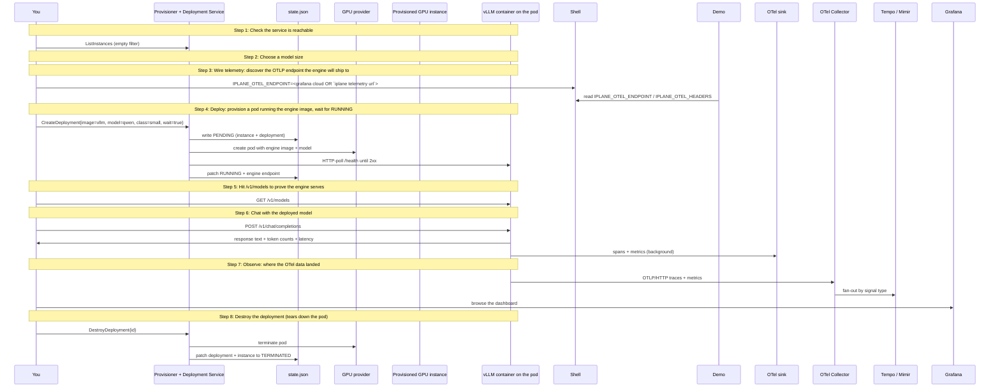

# Deploy end-to-end

Provision a GPU instance, deploy vLLM with an OpenAI-compatible API, hit /v1/models to prove it serves, then tear it all down.

## What you'll learn

- **Check the service is reachable** — CLI form:
- **Choose a model size** — All three are open-weight Qwen models that fit on a 24 GB small-class GPU. Bigger = more capable but slower cold-start and more $.
- **Wire telemetry: discover the OTLP endpoint the engine will ship to** — The engine runs on a remote pod and needs a routable OTLP URL to ship traces / metrics to. iplane supports two sinks:
- **Deploy: provision a pod running the engine image, wait for RUNNING** — One step. CreateDeployment with no instance_id auto-provisions: the control plane rents a small-class pod whose container IS the engine image (image-as-pod). The engine port is reverse-proxied via the provider's HTTPS proxy (no publicIp allocated -- cheapest community capacity), and we HTTP-poll /health on the proxy URL until 2xx. No SSH, no docker-in-docker, no NAT. The instance + deployment are recorded 1:1 (two views -- GPU and model -- of the same pod). Want shell access for debugging? Re-run with --debug-shell (pays the publicIp fee + restricts placement).
- **Hit /v1/models to prove the engine serves** — vLLM's OpenAI-compatible surface exposes /v1/models for the served-model list. A 2xx here means a real OpenAI SDK can hit /v1/chat/completions next.
- **Chat with the deployed model** — The chapter's payoff. You're talking to a model running on a GPU pod you rented 5 minutes ago. Type a prompt; the demo POSTs it to /v1/chat/completions on the engine_endpoint and prints the response + token / latency stats. Hit enter on an empty line to move on to the observe step.
- **Observe: where the OTel data landed** — The query above shipped traces + metrics via OTLP to IPLANE_OTEL_ENDPOINT. Open your sink to see them. For Grafana Cloud Free, log in and navigate to Explore -> Tempo (traces) / Mimir (metrics). For the local stack, open http://localhost:3000 (default creds admin/admin) and use the 'inference-plane v0.1' dashboard. Subsequent /v1/chat/completions calls will surface as additional spans within a few seconds.
- **Destroy the deployment (tears down the pod)** — Terminates the engine pod. Because this deployment auto-provisioned its instance (1:1), the pod IS the instance -- destroying the deployment terminates the pod and marks both records TERMINATED. (For an explicitly-placed deployment on a shared instance, the instance would survive.) Idempotent: already-TERMINATED is a no-op.

## Flow



## Steps

### Setup

This walkthrough deploys a model with one command. The control plane provisions a GPU pod whose container IS the engine image (image-as-pod) -- no SSH, no docker-in-docker. The instance + deployment are recorded 1:1 (the instance shares the deployment id: two views, GPU and model, of the same pod).
Target URL:    http://localhost:9091
Provider:      runpod
Deployment id: demo-llama-20260526t025326 (the instance shares this id)
Cost depends on chosen model size + cold-start. The 1.5B default is ~$0.02 for a full run; 7B is ~$0.12. Defer-terminates on exit / Ctrl-C.

### Step 1: Check the service is reachable

CLI form:
  iplane instance list --service-url http://localhost:9091

### Step 2: Choose a model size

All three are open-weight Qwen models that fit on a 24 GB small-class GPU. Bigger = more capable but slower cold-start and more $.

### Step 3: Wire telemetry: discover the OTLP endpoint the engine will ship to

The engine runs on a remote pod and needs a routable OTLP URL to ship traces / metrics to. iplane supports two sinks:

  - Hosted (Grafana Cloud Free, Honeycomb, etc.): export IPLANE_OTEL_ENDPOINT to your provider's OTLP HTTP URL and IPLANE_OTEL_HEADERS to your auth header (e.g. 'Authorization=Basic <token>'). Zero local infra.

  - Local stack via cloudflared tunnel: run `COMPOSE_PROFILES=tunnel make up`, then export IPLANE_OTEL_ENDPOINT=$(iplane telemetry url). Data lands in the local Grafana at http://localhost:3000.

This step reads IPLANE_OTEL_ENDPOINT from the operator's shell. If unset, the demo hard-fails -- the chapter's telemetry beat doesn't work without a sink, and silent skips would teach the wrong lesson.

### Step 4: Deploy: provision a pod running the engine image, wait for RUNNING

One step. CreateDeployment with no instance_id auto-provisions: the control plane rents a small-class pod whose container IS the engine image (image-as-pod). The engine port is reverse-proxied via the provider's HTTPS proxy (no publicIp allocated -- cheapest community capacity), and we HTTP-poll /health on the proxy URL until 2xx. No SSH, no docker-in-docker, no NAT. The instance + deployment are recorded 1:1 (two views -- GPU and model -- of the same pod). Want shell access for debugging? Re-run with --debug-shell (pays the publicIp fee + restricts placement).

CLI form:
  iplane deployment deploy demo-llama-20260526t025326 --provider runpod --class small --image vllm/vllm-openai:v0.7.0 --model <chosen> --service-url http://localhost:9091

### Step 5: Hit /v1/models to prove the engine serves

vLLM's OpenAI-compatible surface exposes /v1/models for the served-model list. A 2xx here means a real OpenAI SDK can hit /v1/chat/completions next.

CLI form (no native verb; uses the engine_endpoint from `iplane deployment describe`):
  endpoint=$(iplane deployment describe demo-llama-20260526t025326 --service-url http://localhost:9091 -o json | jq -r .engine_endpoint)
  curl -fsS "${endpoint}/v1/models"

### Step 6: Chat with the deployed model

The chapter's payoff. You're talking to a model running on a GPU pod you rented 5 minutes ago. Type a prompt; the demo POSTs it to /v1/chat/completions on the engine_endpoint and prints the response + token / latency stats. Hit enter on an empty line to move on to the observe step.

iplane is NOT in the data path -- the POST goes from this laptop straight to the engine's proxy URL. Each call also ships traces / metrics to your OTel sink (see the previous step's note), so you can watch your queries show up in Grafana as you type them.

CLI equivalent for a single prompt:
  iplane deployment query demo-llama-20260526t025326 "<prompt>" --service-url http://localhost:9091

### Step 7: Observe: where the OTel data landed

The query above shipped traces + metrics via OTLP to IPLANE_OTEL_ENDPOINT. Open your sink to see them. For Grafana Cloud Free, log in and navigate to Explore -> Tempo (traces) / Mimir (metrics). For the local stack, open http://localhost:3000 (default creds admin/admin) and use the 'inference-plane v0.1' dashboard. Subsequent /v1/chat/completions calls will surface as additional spans within a few seconds.

### Step 8: Destroy the deployment (tears down the pod)

Terminates the engine pod. Because this deployment auto-provisioned its instance (1:1), the pod IS the instance -- destroying the deployment terminates the pod and marks both records TERMINATED. (For an explicitly-placed deployment on a shared instance, the instance would survive.) Idempotent: already-TERMINATED is a no-op.

CLI form:
  iplane deployment destroy demo-llama-20260526t025326 --service-url http://localhost:9091

### Done

Pod terminated -- billing stopped. Because the deployment auto-provisioned its instance (1:1), destroying the deployment tore down the pod; the instance record is marked TERMINATED in the same step.
The instance + deployment records remain in the state file as TERMINATED -- an audit trail of what ran. Re-running provisions a fresh pod (each run gets a new timestamped id).

## Run it

```bash
go run ./examples/03-deploy-end-to-end/
```

Pass `--non-interactive` to skip pauses:

```bash
go run ./examples/03-deploy-end-to-end/ --non-interactive
```
