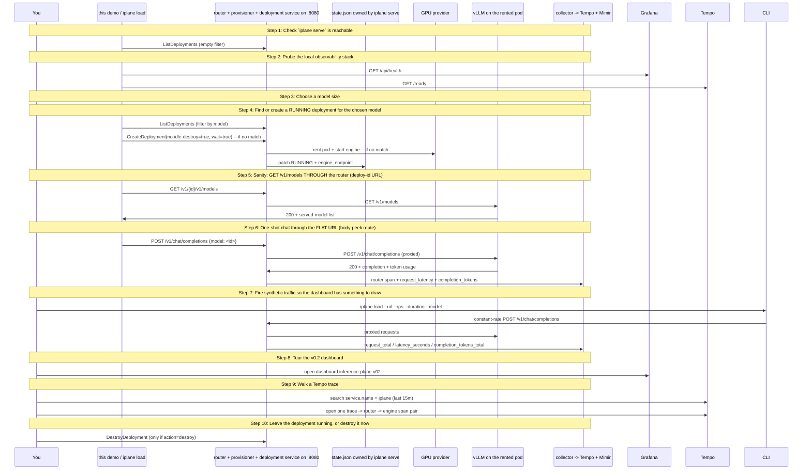

# Router in path (Beat 1 closer)

Drive a chat completion through the v0.2 control plane router, fire synthetic load to populate the v0.2 Grafana dashboard, and walk the resulting Tempo trace. Operator runs `iplane serve` separately; the deployment is created with --no-idle-destroy so demos 05 and 06 can reuse it.

## What you'll learn

- **Check `iplane serve` is reachable** — ListDeployments is the cheapest call that touches the full daemon stack. If this fails, start `iplane serve` in another terminal and retry.
- **Probe the local observability stack** — Grafana and Tempo back the panel/trace tour at the end. The demo only WARNS if either is unreachable -- you can still walk the chapter against a hosted Grafana Cloud or skip dashboards entirely.
- **Choose a model size** — Smallest default keeps the smoke read cheap. Pick 3B or 7B for a fuller dashboard story (more tokens/s, more interesting latency curves).
- **Find or create a RUNNING deployment for the chosen model** — Looks for a RUNNING deployment whose Model matches the choice from the previous step. If one exists, the demo reuses it (zero cost, zero wait). Otherwise CreateDeployment with --no-idle-destroy provisions a fresh pod; the pin ensures the reaper won't destroy it between demo runs.
- **Sanity: GET /v1/models THROUGH the router (deploy-id URL)** — The deploy-id URL shape (`/v1/<deploy-id>/v1/...`) is the unambiguous escape hatch for endpoints with no body to peek at. The router strips the `/v1/<deploy-id>` prefix and forwards the rest to the engine_endpoint. A 2xx here proves the router can reach the engine pod from the operator's laptop.
- **One-shot chat through the FLAT URL (body-peek route)** — The flat URL (`/v1/chat/completions`) is the OpenAI-SDK-compatible shape. The router reads the `model` field from the JSON body, picks the newest RUNNING deployment serving that model, and reverse-proxies the request. This is the URL the chapter's prose calls out: an OpenAI SDK pointed at http://localhost:8080 just works.
- **Fire synthetic traffic so the dashboard has something to draw** — Runs `iplane load` against the flat URL for the configured duration. The router's request/latency/token metrics populate the v0.2 dashboard panels; the trace per request flows through to Tempo. Open Grafana in a browser BEFORE this step starts if you want to watch the panels paint live.
- **Tour the v0.2 dashboard** — The v0.2 dashboard (uid=inference-plane-v02) has three panels populated by what you just fired:
- **Walk a Tempo trace** — Each routed request becomes a trace with one root span on the router side (`iplane.router`) and a child span on the engine side (`engine.generate`). The router span carries deploy_id, tenant_id (if set by client baggage), and the request size; the engine span carries token counts. The chapter's trace narrative reads top-to-bottom from this pair.
- **Leave the deployment running, or destroy it now** — Default: LEAVE it running. The deployment was created with --no-idle-destroy so the reaper will not evict it; demos 05 (fair-queueing) and 06 (multi-replica) will attach to the same daemon and reuse this deployment.

## Flow



## Steps

### Setup

This walkthrough assumes `iplane serve` is running in another terminal on :8080 and (optionally) `make up` is hosting the local observability stack on :3000 / :3200. The demo never starts those itself -- it expects them already up so the same `iplane serve` survives across demos 04/05/06.
Target URL:    http://localhost:8080
Grafana:       http://localhost:3000
Tempo:         http://localhost:3200
Provider:      runpod
Load profile:  5.0 rps for 30s after deploy is RUNNING
Cost: ~$0.05 (1.5B default) up to ~$0.25 (7B). Pod stays alive by default (--no-idle-destroy) so 05/06 can reuse it; opt in to destroy at the end if you're done for the day.

### Step 1: Check `iplane serve` is reachable

ListDeployments is the cheapest call that touches the full daemon stack. If this fails, start `iplane serve` in another terminal and retry.

### Step 2: Probe the local observability stack

Grafana and Tempo back the panel/trace tour at the end. The demo only WARNS if either is unreachable -- you can still walk the chapter against a hosted Grafana Cloud or skip dashboards entirely.

### Step 3: Choose a model size

Smallest default keeps the smoke read cheap. Pick 3B or 7B for a fuller dashboard story (more tokens/s, more interesting latency curves).

### Step 4: Find or create a RUNNING deployment for the chosen model

Looks for a RUNNING deployment whose Model matches the choice from the previous step. If one exists, the demo reuses it (zero cost, zero wait). Otherwise CreateDeployment with --no-idle-destroy provisions a fresh pod; the pin ensures the reaper won't destroy it between demo runs.

CLI form (if you want to create it by hand instead):
  iplane deployment deploy demo-router-<stamp> --provider runpod --class small --image vllm/vllm-openai:v0.7.0 --model <chosen> --no-idle-destroy --service-url http://localhost:8080

### Step 5: Sanity: GET /v1/models THROUGH the router (deploy-id URL)

The deploy-id URL shape (`/v1/<deploy-id>/v1/...`) is the unambiguous escape hatch for endpoints with no body to peek at. The router strips the `/v1/<deploy-id>` prefix and forwards the rest to the engine_endpoint. A 2xx here proves the router can reach the engine pod from the operator's laptop.

The alternative (`engine_endpoint` from describe + curl) bypasses the router entirely -- v0.1's story. v0.2's whole point is that the router IS in the path.

### Step 6: One-shot chat through the FLAT URL (body-peek route)

The flat URL (`/v1/chat/completions`) is the OpenAI-SDK-compatible shape. The router reads the `model` field from the JSON body, picks the newest RUNNING deployment serving that model, and reverse-proxies the request. This is the URL the chapter's prose calls out: an OpenAI SDK pointed at http://localhost:8080 just works.

### Step 7: Fire synthetic traffic so the dashboard has something to draw

Runs `iplane load` against the flat URL for the configured duration. The router's request/latency/token metrics populate the v0.2 dashboard panels; the trace per request flows through to Tempo. Open Grafana in a browser BEFORE this step starts if you want to watch the panels paint live.

```bash
/var/folders/d9/05hxl2g557ddtw7bmg33_lndn40p3p/T/iplane-router-example-2134719749/iplane load --url=http://localhost:8080 --rps=5.0 --duration=30s --model= --max-tokens=80 --chat-fraction=1.0
```

### Step 8: Tour the v0.2 dashboard

The v0.2 dashboard (uid=inference-plane-v02) has three panels populated by what you just fired:

  - Request rate (req/s, per deploy_id)
  - Request latency (p50 / p95 / p99)
  - Completion tokens / sec (per deploy_id)

All three are deploy_id-scoped -- once demos 05/06 add a second deployment, the panels will split by id and the queueing/replica stories will be visible at a glance.

### Step 9: Walk a Tempo trace

Each routed request becomes a trace with one root span on the router side (`iplane.router`) and a child span on the engine side (`engine.generate`). The router span carries deploy_id, tenant_id (if set by client baggage), and the request size; the engine span carries token counts. The chapter's trace narrative reads top-to-bottom from this pair.

### Step 10: Leave the deployment running, or destroy it now

Default: LEAVE it running. The deployment was created with --no-idle-destroy so the reaper will not evict it; demos 05 (fair-queueing) and 06 (multi-replica) will attach to the same daemon and reuse this deployment.

If you're done for the day or running this demo standalone, pick `destroy` -- billing stops as soon as the pod terminates.

Reused-existing deployments are never auto-destroyed here even if you pick `destroy`; the demo only tears down what THIS run created, on the assumption that an existing reusable deployment belongs to a longer-lived workflow.

### Done

Beat 1 closer complete: a request crossed the router, populated the v0.2 dashboard, and laid down a router+engine span pair in Tempo. The router code lives in `internal/router/`; the metrics names live in `metric-names.yaml`; the trace propagation contract is W3C TraceContext + Baggage.
Re-runnable: bring up `iplane serve` once and run this demo again; the detect-and-reuse step on `deploy` will skip provisioning. Demos 05 and 06 (Beat 2 and Beat 3) attach to the same daemon and the same deployment.

## Run it

```bash
go run ./examples/04-router-in-path/
```

Pass `--non-interactive` to skip pauses:

```bash
go run ./examples/04-router-in-path/ --non-interactive
```
