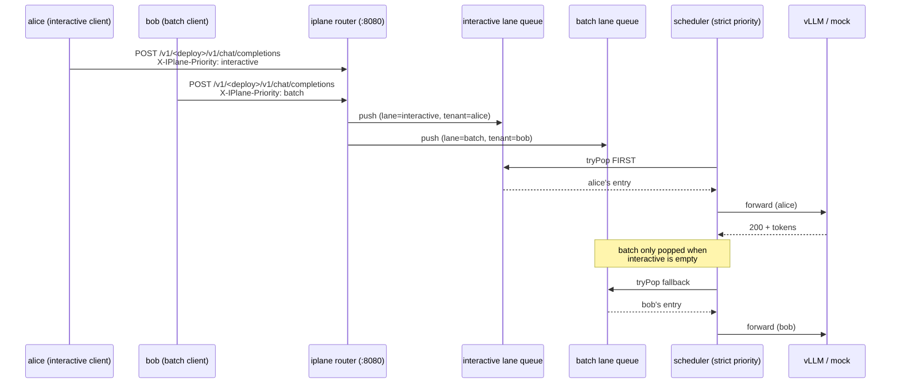

# Demo 05 — Fair-queueing (Beat 2 closer)

The chapter act-3 moment for v0.2 / Ch 7 Beat 2: two parallel
clients at different priority classes hit the same deployment;
**interactive p95 latency stays bounded** while the batch lane's
queue depth and wait-time grow. The Grafana panels visualize the
moment in real time.

## Topology



## What you'll see

- **Queue depth** panel: bob's batch lane grows; alice's interactive lane stays near 0.
- **Queue wait p95** panel: alice's p95 stays sub-100ms; bob's climbs to seconds.
- **Tempo trace** from any batch request: `iplane.queue.wait_ms` on the router span is large; the equivalent attribute from an interactive request is small.
- **Final stats** from each `iplane load`: alice's `latency_p95_ms` is bounded; bob's is not.

## Prerequisites

1. **`iplane serve` running with the scheduler enabled.** Minimum config (in `deploy/config.yaml` or via env):
   ```yaml
   router:
     queue:
       servicers: 2      # MUST be > 0; default 0 disables the scheduler
       capacity: 256
       in_flight_cap: 4  # caps concurrent engine in-flight per deployment
       # Optional per-tenant weights for richer fair-share story:
       # tenant_weights:
       #   alice: 1
       #   bob: 1
   ```
   Restart `iplane serve` after editing.

2. **A RUNNING deployment.** The easiest way: run [`examples/04-router-in-path`](../04-router-in-path/) first — it leaves a deployment alive by default (its final step prompts the operator to keep it for demos 05/06).

3. **Local observability stack** (`make up`) so the Grafana panels populate.

## Run

```bash
bash examples/05-fair-queueing/run.sh <deployment-id>
```

The script fires two `iplane load` processes in parallel against
the same deployment, with different `--priority` + `--tenant`
flags. Default profile:

| Client | Priority      | Rate   | Tenant |
| ------ | ------------- | ------ | ------ |
| alice  | interactive   | 5 rps  | alice  |
| bob    | batch         | 20 rps | bob    |

Override via env vars:

```bash
DEMO_DURATION=90s DEMO_BATCH_RPS=40 \
  bash examples/05-fair-queueing/run.sh my-llama
```

Both clients write their JSON summaries to stdout when done; the
script prints them in two labeled blocks.

## Reading the result

The headline number is **alice's `latency_p95_ms` vs bob's** at the
end of the run. Under strict-priority scheduling with the engine
in-flight cap binding:

- `alice.latency_p95_ms` ≈ engine service time (sub-second on mock,
  ~1s on real vLLM small-class).
- `bob.latency_p95_ms` ≈ engine service time + queue wait, growing
  through the demo as the batch backlog accumulates.

If the gap doesn't appear, check:

1. **Scheduler is enabled.** `router.queue.servicers` > 0 in the
   loaded config. Without the scheduler, the router forwards
   inline and there's no queue to lane traffic in.
2. **In-flight cap is binding.** If `in_flight_cap: 0` (unlimited),
   the engine sees every request immediately and there's no queue
   pressure to demonstrate. Use a small cap (1–4) so requests
   genuinely have to wait.
3. **Real engine, not mock.** Mock backend completes requests in
   microseconds; queue wait is dominated by goroutine scheduling
   noise. Use vLLM (`engine: vllm` + `--profile gpu` on the
   compose stack) for the clean demo, or accept that the mock
   shape will be subtler.

## See also

- [04-router-in-path](../04-router-in-path/) — Beat 1 closer (router in the data path).
- v0.2 Grafana dashboard (`uid=inference-plane-v02`) — Queue depth + wait panels (#80).
- Tempo: filter `iplane.router.priority=batch` to find slow-wait requests.
