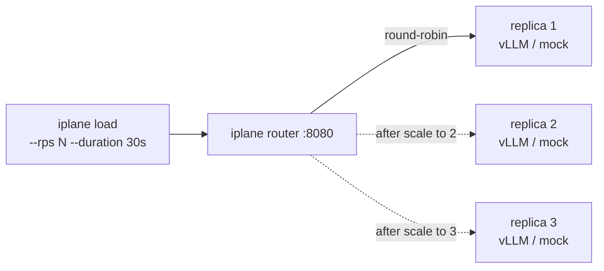

# Demo 06 — Multi-replica throughput curve (Beat 3 closer)

The chapter act-3 moment for v0.2 / Ch 7 Beat 3: scale a single
deployment from 1 → 2 → 3 replicas while a load generator pushes
sustained traffic. **Throughput plateaus at one replica** (engine
service time is the binding constraint), then **scales near-linearly**
as the router fans out to two and three replicas behind the same
deployment ID.

## Topology



The deployment ID doesn't change across scale-ups; only the count
of backing replicas does. Round-robin per-request selection lives
in `internal/router/` (Beat 3.3, #85); the scale verb's mechanics
are in `cmd/iplane/cmd/deployment_scale.go` (Beat 3.4, #86).

## What you'll see

- **Three throughput snapshots** printed by the script at the end —
  one per replica count. Each shows `actual_rps`,
  `completion_tokens_per_sec`, `latency_p95_ms`, and the achieved /
  requested RPS ratio.
- **`actual_rps` headroom at replicas=1**: if the target rate fully
  saturates one replica, `actual_rps` falls noticeably below
  `target_rps` (engine queue + in-flight cap bind). If the
  baseline isn't saturating, the script prints a warning suggesting
  a higher `DEMO_RPS`.
- **Near-linear scaling at replicas=3**: with a saturating baseline,
  `actual_rps` at 3 replicas should approach 3× the single-replica
  achieved rate (modulo cold-start overlap and round-robin
  imbalance noise).
- **Grafana panels** (v0.2 dashboard, `uid=inference-plane-v02`):
  per-replica utilization stays roughly equal across the three
  active replicas; total throughput tracks the achieved RPS.

## Prerequisites

1. **`iplane serve` running.** Router must be in the data path
   (the `:8080` HTTP server proxies to whichever replicas back the
   deployment ID). Default config wires this on.

2. **A running deployment at `replicas=1`.** The cleanest source is
   [`examples/04-router-in-path`](../04-router-in-path/) — it
   provisions a single-replica deployment and leaves it alive by
   default. Pass that deployment's ID into this demo's `run.sh`.

3. **Local observability stack** (`make infra-up`) so the Grafana
   panels populate. Not required for the script to run; only for the
   visual side of the story.

## Run

```bash
bash examples/06-multi-replica/run.sh <deployment-id>
```

Three snapshots are taken back-to-back, with a `iplane deployment
scale` call between each.

Override defaults via env vars:

| Var | Default | What it does |
|-----|---------|--------------|
| `IPLANE_SERVICE_URL` | `http://localhost:8080` | Daemon URL |
| `DEMO_RPS` | `30` | Target rate per snapshot. Bump if the baseline isn't saturating (the script warns when this happens). |
| `DEMO_DURATION` | `30s` | Traffic duration per snapshot. |
| `DEMO_HEALTH_TIMEOUT` | `300` | Seconds to wait for new replicas to become healthy after a scale-up. |

Higher-throughput sweep:

```bash
DEMO_RPS=100 DEMO_DURATION=45s \
  bash examples/06-multi-replica/run.sh my-llama
```

## Reading the result

The headline is the three-row throughput table the script prints
at the end. The shape under saturated baseline:

| Replicas | actual_rps | actual / target | latency_p95_ms |
|----------|-----------:|----------------:|---------------:|
| 1        |     ~12.5  |          ~0.42  |          ~2800 |
| 2        |     ~24.8  |          ~0.83  |          ~1400 |
| 3        |     ~29.4  |          ~0.98  |          ~ 250 |

(Exact numbers depend on engine, model size, and `DEMO_RPS`.) The
chapter narrative is:

- **`actual_rps` per replica.** At replicas=1, achieved rate caps
  at the engine's sustained per-replica throughput. Each added
  replica lifts the cap by roughly the same amount until the
  target rate fits.
- **`latency_p95_ms` drops as queue depth drops.** Once `target_rps
  < per-replica-throughput * N`, the queue stops growing and p95
  collapses to engine service time.

If the gap doesn't appear, check:

1. **Engine is real, not mock.** Mock backend completes requests
   in microseconds — per-replica throughput is tens of thousands
   of RPS, so `DEMO_RPS=30` never saturates one replica and the
   table looks flat across all three counts. For the chapter's
   clean throughput-curve picture, use `engine: vllm` and
   `--profile gpu`. The mock backend still proves the
   plumbing (scale verb, router fan-out, healthy-count poll) but
   not the saturation story.
2. **`DEMO_RPS` is high enough to saturate one replica.** If the
   replicas=1 row shows `actual / target` close to 1.0, the
   script prints a warning. Bump `DEMO_RPS` until the baseline
   row drops below ~0.85.
3. **In-flight cap isn't unlimited.** `router.queue.in_flight_cap`
   bounds concurrent engine requests per deployment. If it's set
   high enough that one replica can absorb the demo load, you
   won't see the queue grow at the baseline. The default
   (`in_flight_cap: 4`) is the right shape; bump only if your
   engine is sized for it.

## See also

- [04-router-in-path](../04-router-in-path/) — Beat 1 closer; the
  source of the running deployment this demo scales.
- [05-fair-queueing](../05-fair-queueing/) — Beat 2 closer; uses
  the same `iplane load` + `iplane serve` shape but with priority
  classes instead of replica counts.
- v0.2 Grafana dashboard (`uid=inference-plane-v02`) — per-replica
  utilization panels (#88), router fan-out routing-decision panel.
- `cmd/iplane/cmd/deployment_scale.go` — the verb the script
  drives. `iplane deployment scale <id> N --wait` (the default)
  blocks until the new replicas reach a terminal aggregate state.
