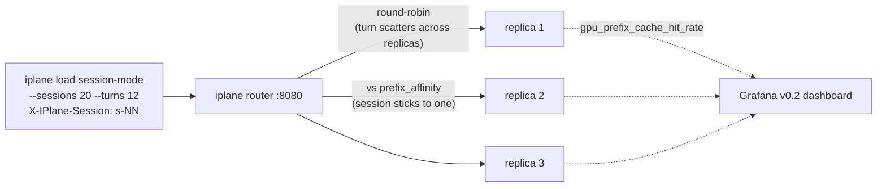

# Demo 07 — Prefix-cache affinity (Ch 8: Stateful Routing and Prefix-Cache Reuse)

> **Status: planned, not yet runnable.** This README is the spec the
> Ch 8 demo is built against. It pins the topology, the reader-facing
> flow, and the metrics the chapter screenshots *before* the code
> lands, so the narrative and the implementation agree. The work items
> that make it real are tracked in the repo (see **Work needed**
> below) and in [`ROADMAP.md`](../../ROADMAP.md) § *Ch 8 four-act
> sketch*. Until those land, the commands here are illustrative.

The chapter act-3 moment for v0.2 / Ch 8: a multi-turn **chat session**
keeps coming back, turn after turn, with a prefix that grows every
turn. Under the Ch 7 round-robin router each turn lands on a different
replica and re-prefills the whole conversation from cold. Switch the
router to **prefix-cache affinity** and a conversation's turns stick to
the replica that already holds its prefix. Same hardware, same model,
same traffic. The prefix-cache hit-rate and time-to-first-token panels
recover.

This demo is **real-cluster only.** The lesson is an engine-side
phenomenon: there is no honest way to feel the latency win on the
`mock` engine, which has no real KV cache. The book promises cost
optimization eventually, but affinity itself runs on paid GPUs. (We
exercise the demo's *plumbing* against `mock` in CI; that path is for
us, not the chapter.)

## Topology



The deployment ID and replica set are unchanged from Ch 7. The only
thing that changes between the two runs is `--routing-policy`. Replica
selection lives behind the seam in
[`internal/router/policy/`](../../internal/router/policy/policy.go);
`RoundRobin` is the Ch 7 default, `PrefixAffinity` is the Ch 8 addition.

## The demos (what the chapter walks through, and asks you to try)

These are written as the reader's path. Build order and the iplane
work each one needs are in **Work needed** at the bottom.

### Demo 07a — Round-robin shreds the cache (the problem)

Run the session driver against the existing round-robin deployment.

```
# illustrative — session mode is work item (1)
iplane load --target <deploy-id> --service-url http://localhost:8080 \
    --sessions 20 --turns 12 --think-time 2s \
    --system-prompt-tokens 800 --routing-policy round_robin
```

**What you'll see.** Prefix-cache hit-rate sits near `1/N` (with three
replicas, about 0.33). TTFT climbs as conversations get longer, because
each turn re-prefills a longer cold history. Per-replica GPU prefill
work is high and mostly redundant.

**Try it yourself (chapter prompt).** Scale the deployment from 3 to 5
replicas and watch the hit-rate get *worse* (toward 0.2), not better.
More replicas means round-robin scatters each session more widely. This
is the counter-intuitive result the chapter dwells on: under round-robin,
adding capacity hurts cache locality.

### Demo 07b — Affinity puts the conversation back together (the fix)

Same deployment, same driver, one flag changed.

```
# illustrative — PrefixAffinity is work item (2)
iplane load --target <deploy-id> --service-url http://localhost:8080 \
    --sessions 20 --turns 12 --think-time 2s \
    --system-prompt-tokens 800 --routing-policy prefix_affinity
```

**What you'll see.** Hit-rate climbs toward 1.0 as each session's turns
return to the replica that holds its prefix. TTFT flattens: later turns
are no slower than early ones because the prefix is already resident.
The router's per-replica in-flight gauges show each session pinned to
one replica instead of spread across all of them.

**Try it yourself (chapter prompt).** Re-run the 5-replica case from
07a under affinity. Hit-rate should hold near 1.0 regardless of replica
count, because affinity decouples cache locality from fan-out width.

### Demo 07c — Affinity is not free (the trade-offs)

Three short variations the chapter uses to show the costs.

1. **The whale session.** Point most of the traffic at a handful of
   session IDs. Those replicas saturate while others sit idle, in
   tension with Ch 7's per-tenant fair-share. Watch the load-aware
   tie-break kick in and break affinity once a replica is hot.
2. **Cache eviction under pressure.** Crank `--sessions` until the
   concurrent KV footprint exceeds GPU memory. Hit-rate drops even
   *under affinity* because the engine evicts blocks. This is the
   "cache memory is the central trade-off" beat, shown with the cheap
   model by raising session count, not by buying a bigger GPU.
3. **Pruning invalidates the cache.** Set conversation length past the
   model's context window so the driver prunes from the front. A
   front-prune changes the prefix and the cache goes cold. The chapter
   contrasts naive front-pruning with keep-system-prompt-plus-recent.

**Try it yourself (chapter prompt).** Find the `--sessions` value where
affinity's hit-rate advantage over round-robin disappears. That is your
deployment's KV-cache working-set ceiling, and the number that tells you
when to add a replica versus when to add GPU memory.

## What you'll measure (Grafana)

- **`prefix_cache_hit_rate`** (new in Ch 8): the headline. Round-robin
  near `1/N`, affinity near `1.0`, both collapsing under 07c's pressure.
- **TTFT p50/p95**: flat under affinity, rising with conversation
  length under round-robin.
- **Per-replica in-flight** (from Ch 7, #88): even spread under
  round-robin, session-pinned clusters under affinity.
- **Routing decisions** (from Ch 7, #87): affinity-hit vs
  affinity-miss vs load-override counts.

## Prerequisites (when runnable)

1. `iplane serve` running with this demo's `config.yaml` (scheduler on,
   router in the data path).
2. A real multi-replica deployment (3 replicas of a small model on
   cheap GPUs is enough; see the chapter for the provider recipe).
   `examples/06-multi-replica` is the closest starting point.
3. Local observability stack (`make infra-up`) for the panels.

## Work needed (repo tickets)

This demo does not run until these land. Tracked as repo issues; see
[`ROADMAP.md`](../../ROADMAP.md) § *Ch 8*.

1. **Session mode on `iplane load`** — closed-loop, stateful per
   session, `X-IPlane-Session` header, multi-turn corpus source.
   Validated against `mock`.
2. **`PrefixAffinity` policy** — second `internal/router/policy.Policy`
   impl, `X-IPlane-Session` resolution, router-side prefix→replica map,
   `--routing-policy` config + flag.
3. **Prefix-cache hit-rate metric family** — `mock` reports a simulated
   hit-rate; real engine surfaces `gpu_prefix_cache_hit_rate`. Grafana
   panel on the v0.2 dashboard.
4. **Load-aware tie-break + prefix-hash variant** — the 07c trade-offs
   and the shared-system-prompt case.
5. **This walkthrough** (`run.sh`, `config.yaml`, `Makefile`) + one
   real multi-replica run for the book figures.
