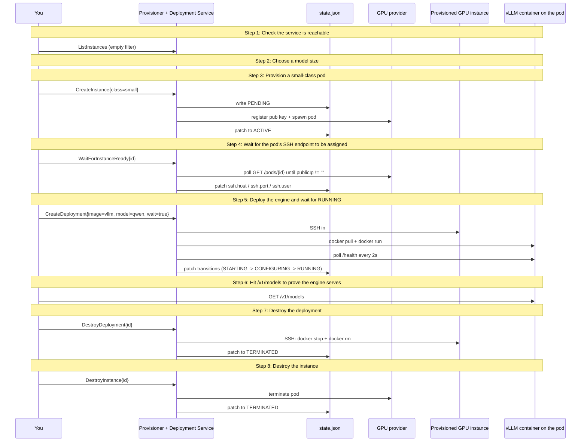

# Deploy end-to-end

Provision a GPU instance, deploy vLLM with an OpenAI-compatible API, hit /v1/models to prove it serves, then tear it all down.

## What you'll learn

- **Check the service is reachable** — CLI form:
- **Choose a model size** — All three are open-weight Qwen models that fit on a 24 GB small-class GPU. Bigger = more capable but slower cold-start and more $.
- **Provision a small-class pod** — class=small => 24 GB VRAM floor. The RunPod resolver picks the cheapest matching SKU. The Service registers an SSH keypair with the RunPod account on first run (PR 24); the resulting pod has that key pre-installed.
- **Wait for the pod's SSH endpoint to be assigned** — RunPod assigns the public IP a few seconds AFTER the pod is scheduled ACTIVE. CreateInstance returns fast (no SSH yet); this step is the explicit 'Join' that blocks until the endpoint shows up. Providers without an SSH-readiness gap (local, future Lambda Labs) make this a no-op.
- **Deploy the engine and wait for RUNNING** — CreateDeployment with Wait=true blocks until the engine is healthy or the deploy fails. The Service's executor SSHes in, docker-pulls the image, docker-runs it with --gpus all, and polls localhost:8000/health from inside the pod until 2xx.
- **Hit /v1/models to prove the engine serves** — vLLM's OpenAI-compatible surface exposes /v1/models for the served-model list. A 2xx here means a real OpenAI SDK can hit /v1/chat/completions next.
- **Destroy the deployment** — Stops + removes the engine container on the pod. The instance keeps running so a follow-up deploy could reuse it. Idempotent: already-TERMINATED is a no-op.
- **Destroy the instance** — Tearing down the pod stops billing. The instance + deployment records remain in the state file as TERMINATED -- an audit trail of what ran.

## Flow



## Steps

### Setup

This walkthrough exercises both the Provisioner and Deployment surfaces end-to-end. The deployment executor SSHes into the provisioned pod and runs docker -- no operator-side docker daemon required.
Target URL:    http://localhost:9091
Provider:      runpod
Instance id:   demo-pod-20260521t225557
Deployment id: demo-llama-20260521t225557
Cost depends on chosen model size + cold-start. The 1.5B default is ~$0.02 for a full run; 7B is ~$0.12. Defer-terminates on exit / Ctrl-C.

### Step 1: Check the service is reachable

CLI form:
  iplane instance list --service-url http://localhost:9091

### Step 2: Choose a model size

All three are open-weight Qwen models that fit on a 24 GB small-class GPU. Bigger = more capable but slower cold-start and more $.

### Step 3: Provision a small-class pod

class=small => 24 GB VRAM floor. The RunPod resolver picks the cheapest matching SKU. The Service registers an SSH keypair with the RunPod account on first run (PR 24); the resulting pod has that key pre-installed.

CLI form:
  iplane instance create runpod demo-pod-20260521t225557 --class small --service-url http://localhost:9091

### Step 4: Wait for the pod's SSH endpoint to be assigned

RunPod assigns the public IP a few seconds AFTER the pod is scheduled ACTIVE. CreateInstance returns fast (no SSH yet); this step is the explicit 'Join' that blocks until the endpoint shows up. Providers without an SSH-readiness gap (local, future Lambda Labs) make this a no-op.

CLI form:
  iplane instance wait demo-pod-20260521t225557 --service-url http://localhost:9091

### Step 5: Deploy the engine and wait for RUNNING

CreateDeployment with Wait=true blocks until the engine is healthy or the deploy fails. The Service's executor SSHes in, docker-pulls the image, docker-runs it with --gpus all, and polls localhost:8000/health from inside the pod until 2xx.

CLI form:
  iplane deployment deploy demo-llama-20260521t225557 --instance demo-pod-20260521t225557 --image vllm/vllm-openai:v0.7.0 --model <chosen> --service-url http://localhost:9091

### Step 6: Hit /v1/models to prove the engine serves

vLLM's OpenAI-compatible surface exposes /v1/models for the served-model list. A 2xx here means a real OpenAI SDK can hit /v1/chat/completions next.

CLI form (no native verb; uses the engine_endpoint from `iplane deployment describe`):
  endpoint=$(iplane deployment describe demo-llama-20260521t225557 --service-url http://localhost:9091 -o json | jq -r .engine_endpoint)
  curl -fsS "${endpoint}/v1/models"

### Step 7: Destroy the deployment

Stops + removes the engine container on the pod. The instance keeps running so a follow-up deploy could reuse it. Idempotent: already-TERMINATED is a no-op.

CLI form:
  iplane deployment destroy demo-llama-20260521t225557 --service-url http://localhost:9091

### Step 8: Destroy the instance

Tearing down the pod stops billing. The instance + deployment records remain in the state file as TERMINATED -- an audit trail of what ran.

CLI form:
  iplane instance destroy demo-pod-20260521t225557 --service-url http://localhost:9091

### Done

Instance and deployment both terminated. State file holds the audit trail (state=TERMINATED on both records).
Re-running this demo provisions a fresh pod -- ids are reusable but each run gets a new timestamped id by default.

## Run it

```bash
go run ./examples/03-deploy-end-to-end/
```

Pass `--non-interactive` to skip pauses:

```bash
go run ./examples/03-deploy-end-to-end/ --non-interactive
```
